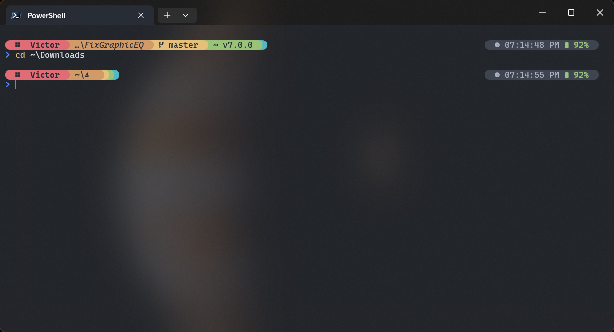
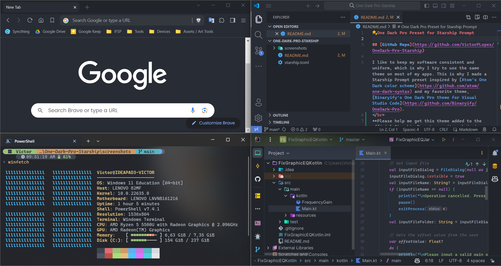
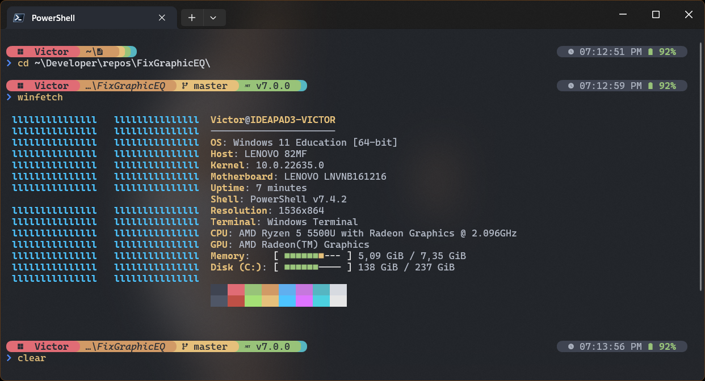
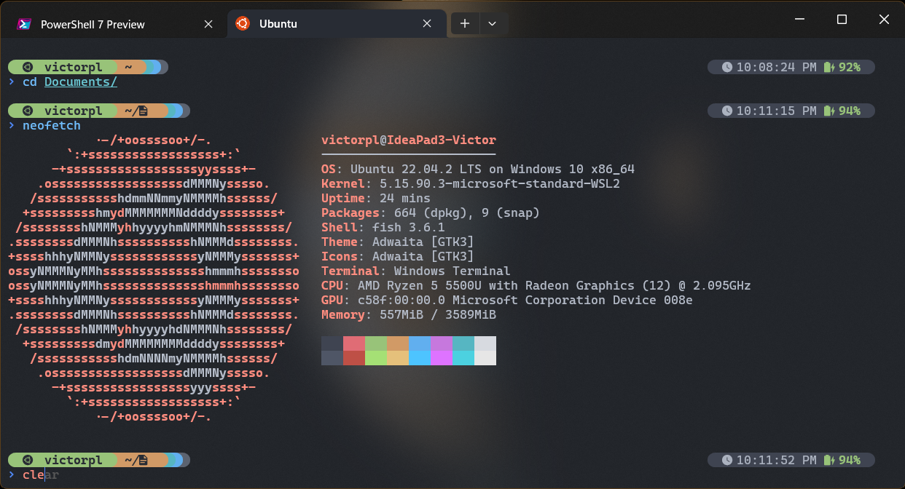

# One Dark Pro Preset for Starship Prompt

## [GitHub Repo](https://github.com/VictorPLopes/OneDark-Pro-Starship)

I like to keep my software consistent and uniform, which is why I try to use the same theme on most of my apps. This is why I made a Starship Prompt preset inspired by [Atom's One Dark color scheme](https://github.com/atom/one-dark-syntax) and my favorite theme, [Binaryify's One Dark Pro theme for Visual Studio Code](https://github.com/Binaryify/OneDark-Pro).
 
**Please help me get this theme added to the official Starship Prompt repository bringing attention to [my open pull request](https://github.com/starship/starship/pull/5345).**

## VictorPL's One Dark Collection

- [One Dark Pro for Visual Studio Code (by Binarify)](https://github.com/Binaryify/OneDark-Pro)
- [One Dark Pro for Visual Studio (by Binarify)](https://marketplace.visualstudio.com/items?itemName=zhuangtongfa.onedarkpro)
- [One Dark Pro for Windows Terminal](https://github.com/VictorPLopes/OneDark-Pro-Windows-Terminal)
- [One Dark Pro for Chromium Browsers](https://github.com/VictorPLopes/OneDark-Pro-Chromium)
- [One Dark Pro for Starship Prompt](https://github.com/VictorPLopes/OneDark-Pro-Starship)
- [One Dark Theme for JetBrains IDEs (by Mark Skelton)](https://plugins.jetbrains.com/plugin/11938-one-dark-theme)

## Screenshots

### PowerShell 7, Windows Terminal, Windows 11

### Fish, Windows Terminal, Ubuntu 22 on Windows 11 (WSL2)

## Pre-requisites

- A [Nerd Font](https://www.nerdfonts.com/) installed and enabled in your terminal (the example screenshots use the Caskaydia Cove Nerd Font).
- If you are using the Windows Terminal, [my One Dark Pro theme for Windows Terminal](https://github.com/VictorPLopes/OneDark-Pro-Windows-Terminal) is highly recommended. There are similar One Dark implementations for other terminal emulators, I suggest you use one of those if you are not using Windows Terminal.

## How to install

Simply download the latest [release](https://github.com/VictorPLopes/OneDark-Pro-Chromium/releases) and save it to Starship's configuration directory, usually located at `~/.config/`. Optionally backup your current `starship.toml` file before replacing it with the one you just downloaded.

## Support me

If you like this theme, and my work, you can always support me via **[Ko-fi](https://ko-fi.com/victorplopes)**. If I get enough support, I will pay the developer registration fee and publish my port of the One Dark Pro theme for Chromium Browsers on the Chrome Web Store.
 

## [CHANGELOG](./CHANGELOG.md)
